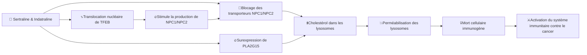

```mermaid

graph LR;
    A[💊 Sertraline & Indatraline]
    B[⤵️Translocation nucléaire de TFEB]
    C[🔥Stimule la production de NPC1/NPC2]
    D[🚫Blocage des transporteurs NPC1/NPC2]
    E[🔥Surexpression de PLA2G15]
    F[⏫Cholestérol dans les lysosomes]
    G[💥Perméabilisation des lysosomes]
    H[💀Mort cellulaire immunogène]
    I[⚔️Activation du système immunitaire contre le cancer]

    A-->B;
    A-->D;
    A-->E;
    B-->C;
    C-->D;
    D-->F;
    F-->G;
    G-->H;
    E-->F;
    H-->I;
```