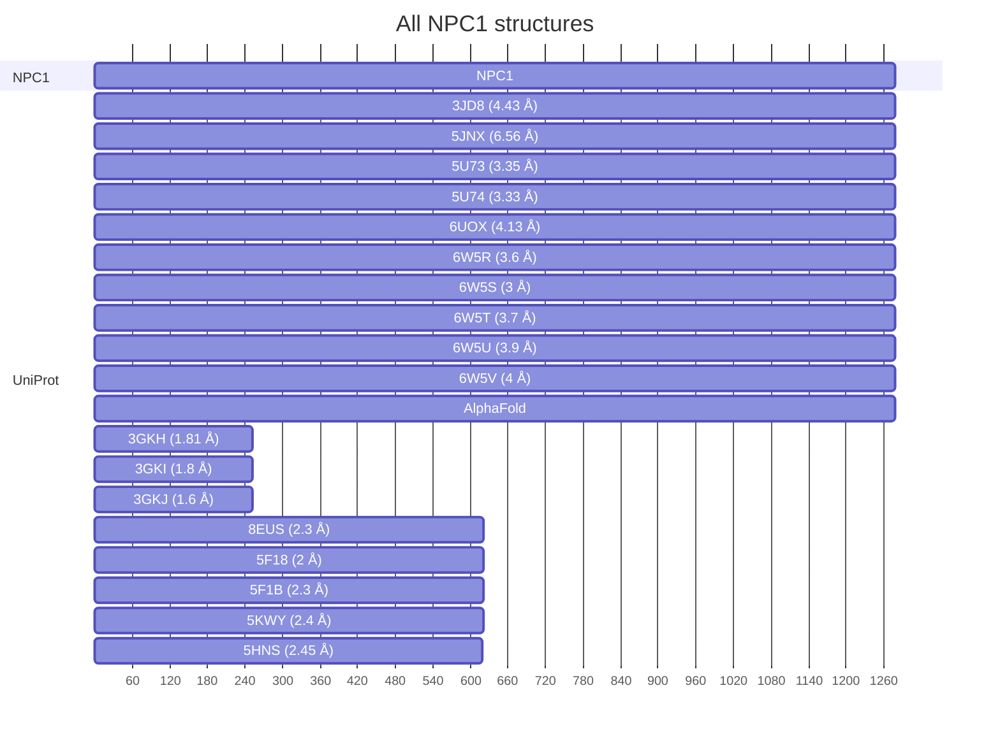

```mermaid
---
displayMode: compact
---
gantt
    title All NPC1 structures
    dateFormat X
    axisFormat %s

    section NPC1
    NPC1: idNPC1, 1, 1278
   
    section UniProt
    3GKH (1.81 Å): id3GKH, 23, 252
    3GKI (1.8 Å): id3GKI, 23, 252
    3GKJ (1.6 Å): id3GKJ, 23, 252
    3JD8 (4.43 Å): id3JD8, 1, 1278
    5F18 (2 Å): id5F18, 374, 620
    5F1B (2.3 Å): id5F1B, 374, 620
    5HNS (2.45 Å): id5HNS, 387, 618
    5JNX (6.56 Å): id5JNX, 1, 1278
    5KWY (2.4 Å): id5KWY, 374, 620
    5U73 (3.35 Å): id5U73, 1, 1278
    5U74 (3.33 Å): id5U74, 1, 1278
    6UOX (4.13 Å): id6UOX, 1, 1278
    6W5R (3.6 Å): id6W5R, 1, 1278
    6W5S (3 Å): id6W5S, 1, 1278
    6W5T (3.7 Å): id6W5T, 1, 1278
    6W5U (3.9 Å): id6W5U, 1, 1278
    6W5V (4 Å): id6W5V, 1, 1278
    8EUS (2.3 Å): id8EUS, 370, 621
    AlphaFold : 1, 1278
```
