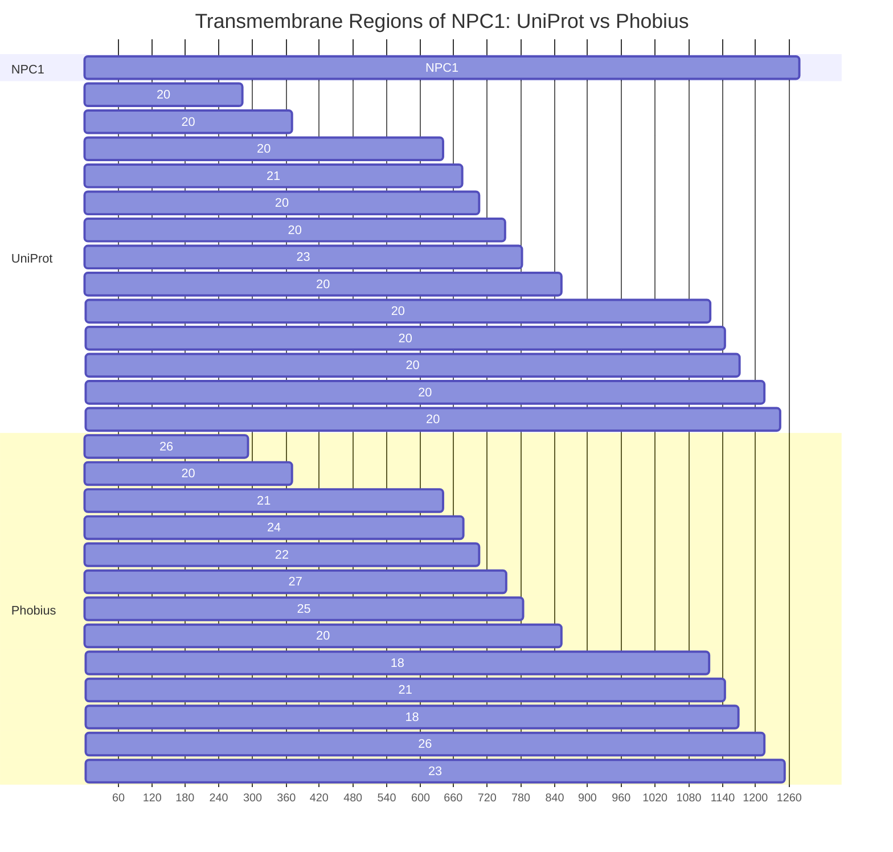

```mermaid
---
displayMode: compact
---
gantt
    title Transmembrane Regions of NPC1: UniProt vs Phobius
    dateFormat X
    axisFormat %s

    section NPC1
    NPC1   : 1, 1278

    section UniProt
    20 : 262, 282
    20 : 351, 371
    20 : 621, 641
    21 : 654, 675
    20 : 686, 706
    20 : 731, 751
    23 : 760, 783
    20 : 833, 853
    20 : 1098, 1118
    20 : 1125, 1145
    20 : 1151, 1171
    20 : 1195, 1215
    20 : 1224, 1244

    section Phobius
    26 : 267, 293
    20 : 351, 371 
    21 : 621, 642
    24 : 654, 678
    22 : 684, 706
    27 : 727, 754
    25 : 760, 785
    20 : 833, 853
    18 : 1099, 1117
    21 : 1124, 1145
    18 : 1151, 1169
    26 : 1190, 1216
    23 : 1228, 1251
```